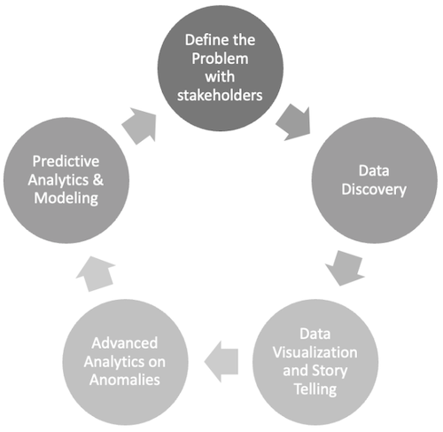
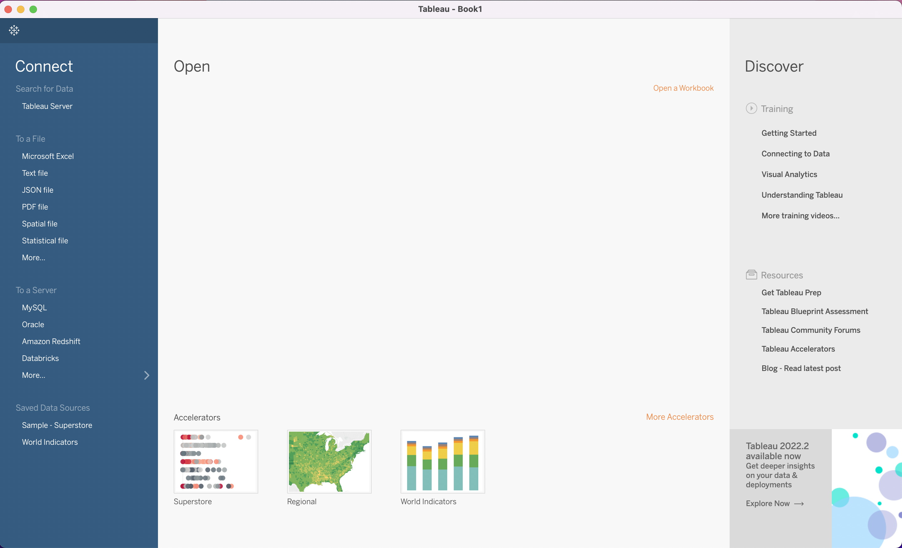

class: center, middle

```{r setup, include=FALSE}
options(htmltools.dir.version = FALSE)
knitr::opts_chunk$set(
    fig.width = 9, 
    fig.height = 3.5, 
    fig.retina = 3,
    out.width = "100%",
    cache = FALSE,
    echo = FALSE,
    message = FALSE, 
    warning = FALSE,
    hiline = TRUE
)
```

```{r xaringan-themer, include = FALSE, warning = FALSE}
library(xaringanthemer)
style_duo_accent(primary_color = "#1a3f6f", 
                 secondary_color = "#52c0ea",
                 code_font_size = "0.5rem",
                 text_font_size = "1.25rem")

# "#f24244"
```

```{r xaringan-logo, echo=FALSE}
library(xaringanExtra)

use_logo(image_url = "files/gfa_logo_clear.png",
         exclude_class = "hide_logo",
         link_url = "https://www.govern4america.org/",
         position = css_position(left = "1em", bottom = "-4em"))
```

# Welcome to our First ~~Lunch~~Dinner and Learn

---

class: left, middle

# Quick Agenda

1. Why Data Science Matters
2. Introduction to Tableau
3. Creating tables
4. Starting to summarize data using appropriate data visualization techniques


---

class: center, middle

# Why Data Science Matters

Being data literate is paramount to a functional democracy. 

---

class: center, middle

# "You can’t improve what you don’t measure." - Peter Drucker (I think)


---

class: center, middle

# So... What is Data Science?


---

class: center, middle

# Ok... but for real, we are here for Tableau... so... Let's do that instead


Open Tableau Desktop (or 
[download it](https://www.tableau.com/support/releases/desktop/2022.2) if you 
haven't already).  

Use the following product key to activate Tableau: TC8K-00F3-45F0-E994-59A6

---

class: left, middle

# First Look at Tableau



---

class: center, middle

# WE NEED SOME DATA!

To begin with, we'll download a csv file and work from that.

[https://tinyurl.com/tableau-session-1-dataset](https://tinyurl.com/tableau-session-1-dataset)

---

class: left, middle

# Let's Jump into Tableau for the Rest of the Session

.pull-left[
- Connecting to data
- Review the data set
- Data mining
- Renaming Variables
- Sheets
]

.pull-right[
- Dimensions vs Measures 
- Filters
- Text tables (a.k.a pivot tables or crosstabs)
- Calculated fields
- Format numbers
]

---

class: center, middle

# Together, Let's Figure Out the 5 Number Summary for Each Zip Code

---

class: center, middle

# Individually, Let's Figure Out the Start Value, End Value, and % Change for Each Zip Code

---

class: center, middle

# For "homework," add in a filter that lets you choose multiple zip codes

---

class: center, middle

# Evaluation!!!!

How did I do? Please fill out this form (which still needs to be created).