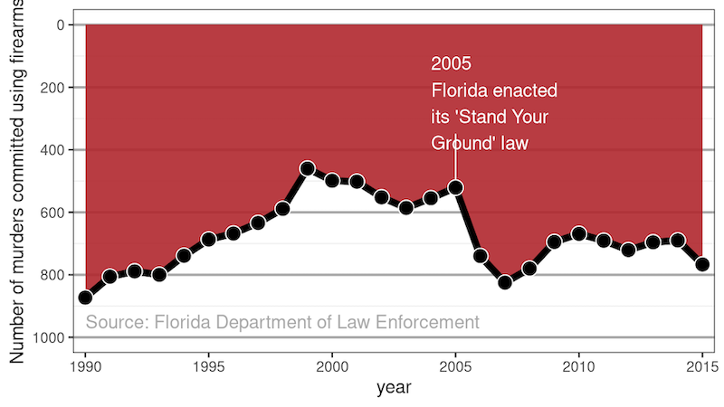
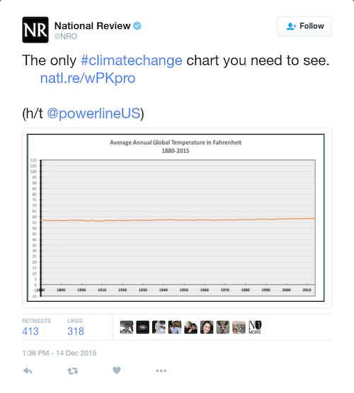
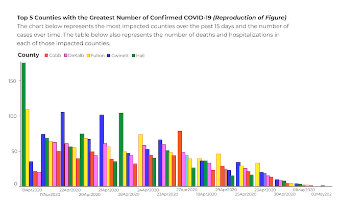

class: center, middle

```{r setup, include=FALSE}
options(htmltools.dir.version = FALSE)
knitr::opts_chunk$set(
    fig.width = 9, 
    fig.height = 3.5, 
    fig.retina = 3,
    out.width = "100%",
    cache = FALSE,
    echo = FALSE,
    message = FALSE, 
    warning = FALSE,
    hiline = TRUE
)
```

```{r xaringan-themer, include = FALSE, warning = FALSE}
library(xaringanthemer)
style_duo_accent(primary_color = "#1a3f6f", 
                 secondary_color = "#52c0ea",
                 code_font_size = "0.5rem",
                 text_font_size = "1.25rem")

# "#f24244"
```

```{r xaringan-logo, echo=FALSE}
library(xaringanExtra)

use_logo(image_url = "files/gfa_logo_clear.png",
         exclude_class = "hide_logo",
         link_url = "https://www.govern4america.org/",
         position = css_position(left = "1em", bottom = "-4em"))
```

# Welcome Back!

---

class: left, middle

# Quick Agenda

1. Review last session: Data Visualization
    - Bar Charts & Scatter Plots
    - Colors
    - Tool Tips
    - Size
    - Creating copies of sheets
2. Data Mining vs. External Communication
    - Analysis vs. Reporting
    - Dashboards
    - Story Boards
3. Presenting Ethically

---

class: center, middle

# LET'S GRAB OUR DATA!

New data! I'll pop it into the Zoom chat. Download all of these to the same 
directory.

---

class: center, middle

# Something new - multiple datasets

Let's join some data in Tableau.

---

class: center, middle

# Review of last session.

Let's create a few visualizations.

---

class: left, middle

# Plot One

1. Create a Line Chart - total hits per year
2. Change the axis to not include zero
3. Let's filter year - there's too many years!

---

class: left, middle

# Plot Two

3. Copy sheet and change it to a bar chart - total HR per year
4. Change the axis TO include zero

---

class: left, middle

# Plot Three

6. Copy sheet and include team as a color
7. Sort team by HR

---

class: center, middle

# I'm Curious, though... in 2021, what was the breakdown of hits per team?

Does anyone know any one-dimensional data graphics?

---

class: left, middle

# Plot Four

1. Add column as a row and select Histogram
2. Add a filter for 2021
3. Explain the distribution

---

class: center, middle

# Turning the plots into a dashboard

Let's create our first dashboard using the charts we've created.

---

class: center, middle

# Turning the plots into a story board

Similar to a dashboard, but allows you to control the "story" and more naturally 
add corresponding text. 

---

class: center, middle

# Lying with Statistics

"Figures often beguile me, particularly when I have the arranging of them myself; in which case the remark attributed to [then British Prime Minister, Benjamin] Disraeli would often apply with justice and force: 'There are three kinds of lies: lies, damned lies, and statistics.'" - Mark Twain, 1907

---

class: center, middle

# Data Visualization can often be Manipulated for Purpose

---

class: center, middle

# Consider the following line chart. What conclusion do you draw?



---

class: center, middle

# Take a Closer Look at the y-axis

What is really happening?


---

class: center, middle


---

class: center, middle



---

class: center, middle

# Everything Looks Small from Far Away


---

class: center, middle

# COVID is Getting Better?

Look at the dates closely... 



---

class: center, middle


