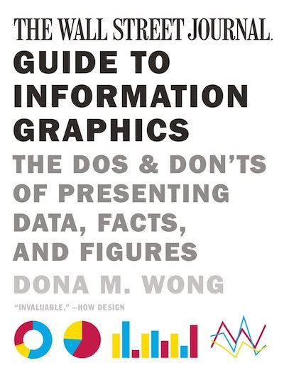

```{r setup, include=FALSE}
options(htmltools.dir.version = FALSE)
knitr::opts_chunk$set(
  fig.width=9, fig.height=3.5, fig.retina=3,
  out.width = "100%",
  cache = FALSE,
  echo = TRUE,
  message = FALSE, 
  warning = FALSE,
  hiline = TRUE
)

library(tibble)
library(knitr)
library(kableExtra)
library(dplyr)
library(scales)
library(ggplot2)
```

```{r xaringan-themer, include = FALSE, warning = FALSE}
library(xaringanthemer)
style_duo_accent(primary_color = "#1a3f6f", 
                 secondary_color = "#52c0ea",
                 code_font_size = "0.5rem")

# "#f24244"
```

```{r xaringan-logo, echo=FALSE}
library(xaringanExtra)

use_logo(image_url = "data_viz_files/gfa_logo_clear.png",
         exclude_class = "hide_logo",
         link_url = "https://www.govern4america.org/",
         position = css_position(left = "1em", bottom = "-4.5em"))
```

.pull-left[
# Who Am I?

- Please call me Jake (I’ll accept Jake from State Farm)  

- I am an Adjunct Professor of Data Science and Statistics @ Villanova 
University  

- Data Science Practice Lead at a company called CivicActions  

- Dad; Data Nerd; Philadelphian  

- Please connect with me!  [www.jakelearnsdatascience.com](www.jakelearnsdatascience.com) 
]

.pull-right[
.center[]

]

---

class: center, middle

# Effective Data Visualization



---

class: center, middle

# How to Create Effective Charts


---

class: left, middle

# 1. Research

This is where you are finding, exploring, and understanding the limitations of 
your data.

```{r iris_explore, echo = FALSE, message = FALSE}
data("iris")

iris <- tibble(iris)
iris %>% 
    head() %>%
    kbl() %>%
    kable_material(c("striped", "hover"))
```

---

class: left, middle

# 2. Edit

This is where you are identifying your key message, choosing the best data to 
convey your message, filtering and simplifying your data, and making numerical 
adjustments.

```{r iris_edit, echo = FALSE, message = FALSE}
sum_iris <- iris %>% 
    group_by(Species) %>% 
    summarise(mean_sepal_length = mean(Sepal.Length),
              mean_sepal_width = mean(Sepal.Width))

iris <- iris %>% 
    right_join(sum_iris, by = "Species") %>% 
    mutate(percent_from_avg = (Sepal.Length - mean_sepal_length) / mean_sepal_length)

sum_iris %>% 
    rename(`Avg Sepal Length` = mean_sepal_length) %>% 
    head() %>%
    kbl() %>%
    kable_material(c("striped", "hover"))
```


---

class: left, middle

# 3. Plot

At this step, you are choosing the proper plot type, ensuring your plot axes are 
correct, title and labels are included, and color and typography are clear.

```{r plot_iris, echo = FALSE}
ggplot(sum_iris, aes(x = reorder(Species, mean_sepal_length), 
                     y = mean_sepal_length)) +
    geom_bar(stat = "identity", fill = "#1a3f6f") + 
    ggtitle("Mean Sepal Length for Iris Data Set", 
            subtitle = "Stock Dataset for Data Science") +
    xlab("Species") +
    ylab("Sepal Length (inches)") +
    coord_flip() + 
    theme(panel.background = element_blank(),
          panel.grid = element_blank(),
          axis.ticks = element_blank())
```

