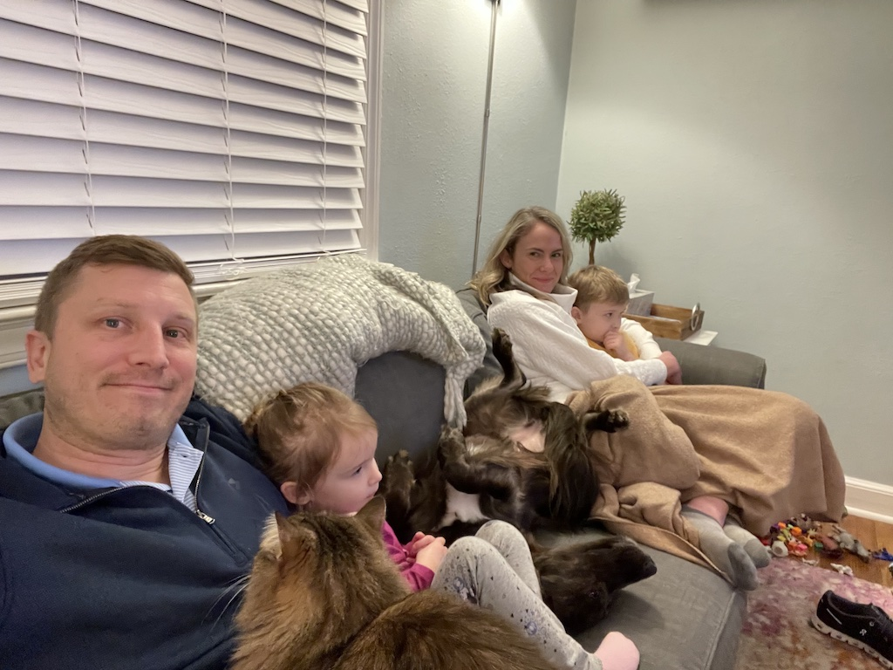

```{r setup, include=FALSE}
options(htmltools.dir.version = FALSE)
knitr::opts_chunk$set(
  fig.width=9, fig.height=3.5, fig.retina=3,
  out.width = "100%",
  cache = FALSE,
  echo = TRUE,
  message = FALSE, 
  warning = FALSE,
  hiline = TRUE
)
```

```{r xaringan-themer, include = FALSE, warning = FALSE}
library(xaringanthemer)
style_duo_accent(primary_color = "#1a3f6f", 
                 secondary_color = "#52c0ea",
                 code_font_size = "0.5rem")

# "#f24244"
```

```{r xaringan-logo, echo=FALSE}
library(xaringanExtra)

use_logo(image_url = "data_viz_files/gfa_logo_clear.png",
         exclude_class = "hide_logo",
         link_url = "https://www.govern4america.org/",
         position = css_position(left = "1em", bottom = "-4.5em"))
```

.pull-left[
# Who Am I?

- Please call me Jake (I’ll accept Jake from State Farm)  

- I am an Adjunct Professor of Data Science and Statistics @ Villanova 
University  

- Data Science Practice Lead at a company called CivicActions  

- Dad; Data Nerd; Philadelphian  

- Please connect with me!  [www.jakelearnsdatascience.com](www.jakelearnsdatascience.com) 
]

.pull-right[
.center[]

]

---