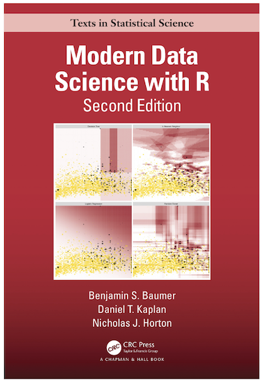
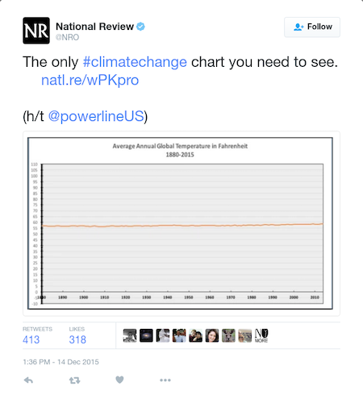

```{r setup, include=FALSE}
options(htmltools.dir.version = FALSE)
knitr::opts_chunk$set(
  fig.width=9, fig.height=3.5, fig.retina=3,
  out.width = "100%",
  cache = FALSE,
  echo = FALSE,
  message = FALSE, 
  warning = FALSE,
  hiline = TRUE
)

library(tibble)
library(knitr)
library(kableExtra)
library(dplyr)
library(scales)
library(ggplot2)
library(RColorBrewer)
library(mdsr)
library(readr)
library(stringr)
library(lubridate)
```

```{r xaringan-themer, include = FALSE, warning = FALSE}
library(xaringanthemer)
style_duo_accent(primary_color = "#1a3f6f", 
                 secondary_color = "#52c0ea",
                 code_font_size = "0.5rem")

# "#f24244"
```

```{r xaringan-logo, echo=FALSE}
library(xaringanExtra)

use_logo(image_url = "data_viz_files/gfa_logo_clear.png",
         exclude_class = "hide_logo",
         link_url = "https://www.govern4america.org/",
         position = css_position(left = "1em", bottom = "-4.5em"))
```

.pull-left[
# Who Am I?

- Please call me Jake (I’ll accept Jake from State Farm)  

- I am an Adjunct Professor of Data Science and Statistics @ Villanova 
University  

- Data Science Practice Lead at a company called CivicActions  

- Dad; Data Nerd; Philadelphian  

- Please connect with me!  [www.jakelearnsdatascience.com](www.jakelearnsdatascience.com) 
]

.pull-right[
.center[]

]

---

class: center, middle

# Where is this "Expertise" Coming From?


---

class: center, middle

# Where Else is this "Expertise" Coming From?



---

class: left, middle

# Getting Setup for In-Class Exercise

## [Download and open (in Excel) the Iris dataset](https://github.com/jrozra200/GFA/blob/main/Data%20Visualization/Data%20Exercise/iris_data.csv) OR

- PREFERRED - but only if you already have Microsoft Excel installed!
- [https://tinyurl.com/iris-download](https://tinyurl.com/iris-download)

## [Open the data in Google Sheets](https://docs.google.com/spreadsheets/d/1urFs4EiL2DpRT-JVdxqKS9kWyG9051qoZ7B4oxWNsF8/edit?usp=sharing)

- Make a copy of the spreadsheet so you can edit!
- [https://tinyurl.com/GFA-iris-google-sheets](https://tinyurl.com/GFA-iris-google-sheets)

---

class: center, middle

# How to Create Effective Charts


---

class: left, middle

# 1. Research

This is where you are finding, exploring, and understanding the limitations of 
your data.

```{r iris_explore, echo = FALSE, message = FALSE}
data("iris")

iris <- tibble(iris)
iris %>% 
    head() %>%
    kbl() %>%
    kable_material(c("striped", "hover"))
```

---

class: center, middle

# Who can tell me something about the dataset?

---

class: left, middle

# 2. Edit

This is where you are identifying your key message, choosing the best data to 
convey your message, filtering and simplifying your data, and making numerical 
adjustments.

---

class: center, middle

# What is something we can explore?

---

class: left, middle

# Average Sepal Length and Width by Species

Let's create this together. 

```{r iris_edit, echo = FALSE, message = FALSE}
sum_iris <- iris %>% 
    group_by(Species) %>% 
    summarise(mean_sepal_length = mean(Sepal.Length),
              mean_sepal_width = mean(Sepal.Width))

iris <- iris %>% 
    left_join(sum_iris, by = "Species") %>% 
    mutate(percent_from_avg_l = (Sepal.Length - mean_sepal_length) / mean_sepal_length,
           percent_from_avg_w = (Sepal.Width - mean_sepal_width) / mean_sepal_width) 

iris <- iris %>% 
    mutate(color = ifelse(percent_from_avg_l == min(iris$percent_from_avg_l), 
                          "black", "red"))

sum_iris %>% 
    rename(`Avg Sepal Length` = mean_sepal_length,
           `Avg Sepal Width` = mean_sepal_width) %>% 
    head() %>%
    kbl() %>%
    kable_material(c("striped", "hover"))
```
---

class: left, middle

# Difference from the Average for Each Row

Let's create this together. 

```{r difference, echo = FALSE, message = FALSE}
iris %>% 
    select(Sepal.Length,
           Sepal.Width,
           Species,
           mean_sepal_length,
           mean_sepal_width,
           percent_from_avg_l,
           percent_from_avg_w) %>% 
    mutate(percent_from_avg_l = round(percent_from_avg_l, 3),
           percent_from_avg_w = round(percent_from_avg_w, 3)) %>% 
    rename(`Sepal Length` = Sepal.Length,
           `Sepal Width` = Sepal.Width,
           `Avg. Length` = mean_sepal_length,
           `Avg. Width` = mean_sepal_width,
           `Pct. Diff. Len.` = percent_from_avg_l,
           `Pct. Diff. Wid.` = percent_from_avg_w) %>%
    head() %>%
    kbl() %>%
    kable_material(c("striped", "hover"))
```

---

class: left, middle

# 3. Plot

At this step, you are choosing the proper plot type, ensuring your plot axes are 
correct, title and labels are included, and color and typography are clear 
(more on that shortly).

```{r plot_iris, echo = FALSE}
ggplot(sum_iris, aes(x = reorder(Species, mean_sepal_length), 
                     y = mean_sepal_length)) +
    geom_bar(stat = "identity", fill = "#1a3f6f") + 
    ggtitle("Mean Sepal Length for Iris Data Set", 
            subtitle = "Stock Dataset for Data Science") +
    xlab("Species") +
    ylab("Sepal Length (inches)") +
    coord_flip() + 
    theme(panel.background = element_blank(),
          panel.grid = element_blank(),
          axis.ticks = element_blank())
```

---

class: left, middle

```{r initial_scatter, echo = FALSE}
ggplot(iris, aes(x = percent_from_avg_l, 
                 y = percent_from_avg_w)) +
    geom_point(color = "#1a3f6f") + 
    geom_hline(yintercept = 0) + 
    geom_vline(xintercept = 0) +
    ggtitle("Percent Difference from Averages") +
    xlab("Percent Difference from Length") +
    ylab("Percent Difference from Width") +
    scale_x_continuous(labels = percent_format()) +
    scale_y_continuous(labels = percent_format()) +
    theme(panel.background = element_blank(),
          panel.grid = element_blank(),
          axis.ticks = element_blank(),
          legend.position = "none")
```

---

class: left, middle

# 4. Review

Often overlooked due to expediency, ensuring the data is accurate will preempt 
questions and enhance trust in the data. 

--

```{r plot_review, echo = FALSE}
ggplot(iris, aes(x = percent_from_avg_l, 
                 y = percent_from_avg_w, 
                 color = color)) +
    geom_point() + 
    scale_color_manual(values = c("red", "#1a3f6f")) + 
    geom_hline(yintercept = 0) + 
    geom_vline(xintercept = 0) +
    ggtitle("Percent Difference from Averages", 
            subtitle = "Is the Red Point an Outlier or Bad Data?") +
    xlab("Percent Difference from Length") +
    ylab("Percent Difference from Width") +
    scale_x_continuous(labels = percent_format()) +
    scale_y_continuous(labels = percent_format()) +
    theme(panel.background = element_blank(),
          panel.grid = element_blank(),
          axis.ticks = element_blank(),
          legend.position = "none")
```


---

class: middle, center

# It is _easy_ to slap something together. It is **HARD** to put something clean, clear, and meaningful together.

---

class: top, left

# A taxonomy for data graphics

Taxonomy, smaxonomy. That's just a fancy name for saying you got to know the 
finer parts of a data viz before you, too, can make fine data viz. 

.pull-left[
Data graphics can be understood in terms of four basic elements: 

1. Visual cues
2. Coordinate systems
3. Scale
4. Context
]

.pull-right[
*And two bonus items:* 

1. Facets
2. Layers
]

---

class: top, left

# Visual Cues 

**These are the building blocks of data viz.** Visual cues are graphical 
elements that draw the eye to what we want our audience to focus upon. Human 
beings' ability to perceive difference in magnitude accurately decends in this 
order.

```{r viz_cue}
tribble(
        ~`Visual Cue`, ~`Variable Type`, ~Question,
        "Position", "numerical", "where in relation to other things?",
        "Length", "numerical", "how big (in one dimension)?",
        "Angle", "numerical", "how wide? parallel to something else?",
        "Direction", "numerical", "at what slope? in a time series, going up or down?",
        "Shape", "categorical", "belonging to which group?",
        "Area", "numerical", "how big (in two dimensions)?",
        "Volume", "numerical", "how big (in three dimensions)?",
        "Shade", "either", "to what extent? how severely?",
        "Color", "either", "to what extent? how severely?"
    ) %>%
        mdsr_table(caption = "Visual cues and what they signify.") %>%
        kableExtra::column_spec(3, width = "24em")
```

---

# Position, Length, & Area

Because I feel like this is getting a little too much me talking at you, let us 
do an example together.

Someone tell me what they see in this plot, especially as it relates to 
**position**, **length**, and **area**? Which letter has the most?

```{r bad_good, echo = FALSE}
bad_dat <- data.frame(variable = c("a", "b", "c", "d", "e"),
                      value = c(22, 21, 20, 19, 18))

bad_graph <- ggplot(bad_dat, aes(x = "", y = value, fill = variable)) +
    geom_bar(stat = "identity") + 
    coord_polar("y", start = 0) + 
    scale_fill_brewer(palette = "Blues") + 
    theme(legend.position = "top",
          legend.title = element_blank(),
          panel.background = element_blank(),
          axis.ticks = element_blank(),
          axis.title = element_blank(),
          axis.text = element_text(size = 12),
          legend.text = element_text(size = 12))

better_graph <- ggplot(bad_dat, aes(x = variable, y = value, fill = variable)) +
    geom_bar(stat = "identity") + 
    scale_fill_brewer(palette = "Blues") + 
    theme(legend.position = "top",
          legend.title = element_blank(),
          panel.background = element_blank(),
          axis.ticks = element_blank(),
          axis.title = element_blank(),
          panel.grid.major.y = element_line(color = "light gray"),
          axis.text = element_text(size = 12),
          legend.text = element_text(size = 12))
```


.pull-left[
```{r bad_graph, echo = FALSE, out.width = "100%", fig.height = 6}
bad_graph
```
]

--

.pull-right[
```{r better_graph, echo = FALSE, out.width = "100%", fig.height = 6}
better_graph
```
]

---

class: top, left

### Direction

What **direction** do we see in this plot? Anything else?

```{r direction_code}
ggplot(iris, aes(x = Sepal.Length, y = Sepal.Width)) + 
    geom_point() + 
    theme(panel.background = element_blank(),
          axis.ticks = element_blank(),
          axis.title = element_blank(),
          panel.grid.major.y = element_line(color = "light gray"),
          panel.grid.major.x = element_line(color = "light gray"),
          panel.grid.minor.y = element_blank(),
          panel.grid.minor.x = element_blank())
```


---

class: top, left

### Angle, Color, Shape

Talk to me about the **angle, color, and shape**.

```{r acs_code}
ggplot(iris, aes(x = Sepal.Length, 
                 y = Sepal.Width, 
                 color = Species, 
                 shape = Species)) + 
    geom_point() + 
    geom_smooth(method = "lm", se = FALSE) + 
    scale_color_brewer(palette = "Blues") + 
    theme(panel.background = element_blank(),
          axis.ticks = element_blank(),
          axis.title = element_blank(),
          panel.grid.major.y = element_line(color = "light gray"),
          panel.grid.major.x = element_line(color = "light gray"),
          panel.grid.minor.y = element_blank(),
          panel.grid.minor.x = element_blank())
```


---

class: left, middle

# Plots Speak Louder than Words

.pull-left[

## Do NOT!

> Company A had revenues of $1MM and Company B had revenues of $750k in FY2021.

]

.pull-right[

## Do!

```{r plots, echo = FALSE}
plot_dat <- tibble(company = c("A", "B"),
                   revenue = c(1000000, 750000))

ggplot(plot_dat, aes(x = reorder(company, revenue), y = revenue)) +
    geom_bar(stat = "identity", fill = "#1a3f6f") +
    scale_y_continuous(limits = c(0, 1100000)) +
    geom_text(aes(label = dollar(revenue)), hjust = 0, size = 5) + 
    ggtitle("Annual Company Earnings ($)", 
            subtitle = "Visualization Gives a Fuller Understanding of the Data.") +
    xlab("Company") +
    ylab("Revenue ($)") +
    coord_flip() + 
    theme(panel.background = element_blank(),
          panel.grid = element_blank(),
          axis.ticks = element_blank(), 
          axis.text.y = element_text(size = 14),
          axis.text.x = element_blank(),
          axis.title = element_blank(),
          plot.title = element_text(size = 18))
```
]

---

class: left, middle

# Let the Data Speak for Itself

Do not use any bs to make the graph "pretty." A clean crisp chart allows the 
reader to focus on the data and the message of the story.

This means:

1. No 3D rendering EVER
2. No "pretty" colors (more on this soon)
3. No heavy grid lines
4. NEVER NEVER NEVER a pie chart (though the WSJ doesn't agree with me)

---

class: left, middle

# Misrepresenting the Trend

.pull-left[
    
]

.pull-right[

```{r temp, fig.height = 8}
dat <- read_csv("data_viz_files/tas_timeseries_annual_cru_1901-2020_USA.csv") %>% 
    select(year, `United States`) %>% 
    rename(temp = `United States`) %>% 
    mutate(year = as_date(paste0(year, "-01-01")),
           temp = (temp * 1.8) + 32)

ggplot(dat, aes(x = year, y = temp)) + 
    geom_line(size = 1.25) + 
    scale_y_continuous(limits = c(mean(dat$temp) - 4, mean(dat$temp) + 4)) + 
    ggtitle("Average US Temperature in Fahrenheit\n1901 - 2020") + 
    theme(panel.background = element_blank(),
          axis.ticks = element_blank(), 
          axis.title= element_blank(),
          axis.text = element_text(size = 14),
          plot.title = element_text(size = 18),
          panel.grid.major.y = element_line(color = "light gray"),
          panel.grid.major.x = element_blank())

```

]

---

class: left, middle

# Misrepresenting the Trend

.pull-left[

- The data should fill about 2/3 of the y-axis height
  
- The line should not be too thick or thin
  
- The grid shouldn't be thicker than the line
  
- The y-axis increments shouldn't be awkward
    - Natural increments: (1s, 2s, 5s, 10s, etc.)
    - Awkward increments: (3s, 6s, 6s, 8s, etc.)

]

.pull-right[

```{r temp_2, fig.height = 8}
ggplot(dat, aes(x = year, y = temp)) + 
    geom_line(size = 1.25) + 
    scale_y_continuous(limits = c(mean(dat$temp) - 4, mean(dat$temp) + 4)) + 
    ggtitle("Average US Temperature in Fahrenheit\n1901 - 2020") + 
    theme(panel.background = element_blank(),
          axis.ticks = element_blank(), 
          axis.title= element_blank(),
          axis.text = element_text(size = 14),
          plot.title = element_text(size = 18),
          panel.grid.major.y = element_line(color = "light gray"),
          panel.grid.major.x = element_blank())

```

]

---

class: left, middle

# Zero Baseline

- With line charts, as we just saw, we want the y-axis to be the right size
- With bar charts, we are interpreting area; because of this, we always start 
at 0

--

.pull-left[

]

--

.pull-right[

]

# Order Bars in the correct order

Covid GA data

# Negative goes left or down, positive goes right or up

Stand your ground 

# Need another exercise
# What's next? Training and such